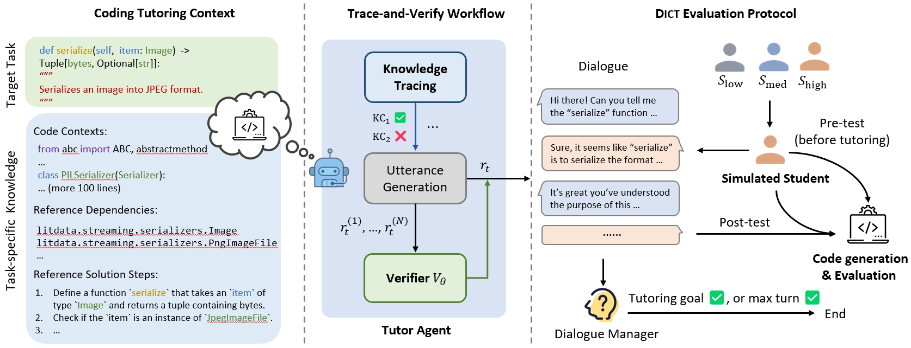

# TRAVER + McMiner: LLM-Based Coding Tutors with Misconception Mining

> **CSEN-346-Sp26 — Group 2** · Santa Clara University

This project reproduces and extends the **TRAVER** (Training and Verifying Reasoning-Enhanced Tutoring) framework for building LLM-based coding tutors. We introduce **McMiner-in-the-Loop**, a pedagogical strategy that integrates automated misconception detection into the tutoring dialogue, and evaluate its impact on student code generation outcomes using the EvoCodeBench-2403 benchmark.

## 📌 Resources

| Resource | Link |
|----------|------|
| 🌐 **Live Demo** | [mcminer-coding-tutor.netlify.app](https://mcminer-coding-tutor.netlify.app) |
| 📄 **Paper** | [Bridging Misconception Detection and Dialogue-Based Tutoring for Programming Education (PDF)](paper/Bridging%20Misconception%20Detection%20and%20Dialogue-Based%20Tutoring%20for%20Programming%20Education.pdf) |
| 🎤 **Presentation** | [Mcminer-coding-tutor (PDF)](paper/Mcminer-coding-tutor.pdf) |
| 🪧 **Poster** | [Poster mcminer-tutor (PDF)](paper/poster%20mcminer-tutor.pdf) |

### Demo Modes

The demo has two modes:

1. **Dialogue Replay** (default) — Browse pre-recorded tutoring dialogues comparing baseline TRAVER vs McMiner-TRAVER side by side. Select different tasks and student levels to see how McMiner's misconception detection changes the conversation. No API keys needed.

2. **Semi-Live Auto-Play** — Watch real tutoring sessions generated live by calling the actual LLM APIs. Both TRAVER-only and McMiner-TRAVER run simultaneously in side-by-side panes so you can compare them in real time. **Requires two API keys:**
   - **HuggingFace API key** — for the tutor (Llama 70B), student (Qwen 7B), and codegen (Llama 8B) models. Get one free at [huggingface.co/settings/tokens](https://huggingface.co/settings/tokens).
   - **Google Gemini API key** — for McMiner misconception detection (Gemini 2.5 Flash). Get one free at [aistudio.google.com/apikey](https://aistudio.google.com/apikey).

   Keys stay in your browser session only — they are never sent to any server other than the official API endpoints.



---

## Table of Contents

- [Overview](#overview)
- [Resources](#-resources)
- [Key Results](#key-results)
- [Models](#models)
- [Methodology](#methodology)
- [Experimental Timeline](#experimental-timeline)
- [Detailed Results](#detailed-results)
- [Setup & Usage](#setup--usage)
- [Project Structure](#project-structure)

---

## Overview

We simulate a tutoring session where:

1. A **tutor LLM** (70B) guides a student through a coding task using hints and feedback
2. A **student LLM** (8B) plays the role of a learner, asking questions and attempting solutions
3. After the dialogue, a **code generation model** produces code based on the tutoring conversation
4. The generated code is evaluated against test suites using **Pass@k** and **Recall@k** metrics

The original TRAVER paper benchmarks on **EvoCodeBench-2403** (100 repository-level Python tasks across 14 projects). Due to environment and computing constraints — many projects require Linux-only dependencies (CUDA extensions, OpenGL), specialized GPU hardware, or have corrupted source files on our cluster — we focused our evaluation on a **subset of 4 projects (22 tasks)** that we could reliably build and test:

| Project | Tasks | Why Selected |
|---------|-------|--------------|
| **EasyVolcap** | 12 | Complex 3D/GPU project — most challenging and informative |
| **searcharray** | 6 | Pure Python — tests reasoning without environment issues |
| **sd-forge** | 3 | Stable baseline — consistently high pass rates |
| **UHGEval** | 1 | Stable baseline — validates pipeline correctness |

---

## Key Results

### 🏆 Headline: McMiner-Clean +15.9pp over Baseline on High-Level Students

| Level | Baseline Best P@1 | McMiner-Clean Best P@1 | Δ |
|-------|-------------------|------------------------|---|
| **high_level** | 15.8% (R1) | **31.7% (R7)** | **+15.9pp** ✅ |
| med_level | 16.0% (R4) | 17.5% (R8) | +1.5pp ≈ Tie |
| low_level | 23.0% (R7) | 10.8% (R1) | −12.2pp ❌ |

*EasyVolcap project subset, 12 tasks, n=10 completions/task*

### Same-Round Comparison (R7, high_level)

| Metric | Baseline | McMiner-Loop | McMiner-Clean |
|--------|----------|-------------|---------------|
| Pass@1 | 6.0% | 24.2% | **31.7%** |
| Pass@3 | 12.2% | 35.7% | **40.8%** |
| Pass@5 | 15.0% | 39.6% | **41.6%** |
| Pass@10 | 20.0% | 41.7% | **41.7%** |

### vs. Paper Baseline (Same 4-Project Subset, Weighted Average)

Comparing against the paper's reported results on the **same 4 projects** (apples-to-apples):

| Level | Paper P@1 | Our P@1 | Δ |
|-------|-----------|---------|---|
| low_level | 20.5% | **28.9%** | **+8.4pp** |
| med_level | 22.3% | **25.1%** | **+2.8pp** |
| high_level | 19.5% | **28.6%** | **+9.1pp** |

**On the 22-task subset we evaluated, we outperform the original TRAVER paper by +6.8pp average P@1.**

> **Note:** The full EvoCodeBench-2403 benchmark contains 100 tasks across 14 projects. We did not evaluate the remaining 78 tasks due to environment constraints (Linux-only CUDA builds, corrupted source files, missing dependencies on our HPC cluster).

---

## Models

| Role | Model | Notes |
|------|-------|-------|
| **Tutor** | `Llama-3.1-70B-Instruct` | Primary tutor via HF Inference API (also `Llama-3.3-70B-Instruct` in some runs) |
| **Student** | `Mistral-7B-Instruct-v0.2` | Simulated student for dialogue (downloaded locally on Colab) |
| **Code Generation** | `Llama-3.1-8B-Instruct` | n=10, T=0.4, top_p=0.95, max_tokens=1024 via HF API |
| **Verifier** | Fine-tuned `Mistral-7B-v0.1` | Trained on vanilla dialogue outcome data |
| **McMiner** | `Gemini 2.5 Flash` | Misconception detection via Google API |

> **Note — Deviation from the original paper:** The TRAVER paper uses the same student model (Mixtral-8x7B-Instruct) for both dialogue simulation and post-test code generation. We used **Mistral-7B-Instruct-v0.2** for dialogue but **Llama-3.1-8B-Instruct** for code generation because we could not load the Mistral model on HPC due to memory constraints. Code generation is an isolated step — the model receives the dialogue transcript as input context and generates code from it, with no learning or state carried over from the dialogue phase. The choice of code generation model affects output quality but not the tutoring interaction itself.

### Pipeline Split: Colab + HPC

Due to resource constraints, our pipeline was split across two environments:

1. **Dialogue generation (Colab):** Tutor (`Llama-3.1-70B`) and student (`Mistral-7B`) dialogues were generated on Google Colab using the HuggingFace Inference API, since loading these models locally on HPC exceeded available GPU memory.
2. **Code generation + evaluation (HPC):** Post-test code generation (`Llama-3.1-8B` via HF API) and test execution were done on the SCU WAVE HPC cluster. EasyVolcap in particular could not be evaluated on Colab due to dependency issues (requires a different Python version and Linux-only CUDA extensions), so we created an isolated pyenv on HPC with the specific requirements needed to run the full evaluation pipeline there.

---

## Methodology

### Vanilla Instruct

The baseline. The tutor LLM is simply instructed to act as a coding tutor with no special pedagogical strategies. 8 rounds of multi-turn dialogue.

### TRAVER

Extends Vanilla with a **trained verifier** that scores candidate tutor responses and selects the best one at each turn. The verifier is trained on outcome data from vanilla dialogues.

**Pipeline:** Generate vanilla dialogues → Evaluate → Train verifier → Re-generate with verifier → Evaluate

### McMiner-Loop

Our extension adds **misconception mining** to the tutoring loop. Before generating a hint, the tutor:

1. Analyzes the student's latest code attempt
2. Identifies specific misconceptions (wrong API usage, incorrect logic, etc.)
3. Generates targeted hints that directly address diagnosed misconceptions

This is a **prompt-only modification** — no model retraining required.

**Detection stats (175 samples):** 81.1% detection rate, 92.3% high confidence. Detection rate increases with turns: 41% at Turn 1 → 96% at Turn 15.

### McMiner Variants

| Variant | Rounds | Description |
|---------|--------|-------------|
| **McMiner-Loop** | 8 | Standard misconception injection per round |
| **McMiner-Clean** | 8 | Loop + misconception meta-text stripped before codegen |
| **McMiner-Clean-Ctx** | 8 | Clean + additional context window |
| **McMiner-Dedup** | 8 | Semantic deduplication (skip repeated misconceptions) |
| **McMiner-Thorough** | 12 | Dedup + dynamic rounds + accumulated context + no early stop |
| **McMiner-Thorough-Clean** | 12 | Thorough + clean prompts combined |

> **Why Clean-Prompt?** Misconception meta-text (e.g., "I notice you have a misconception about...") can confuse the codegen model. Stripping it lets the model focus on technical code hints. The +15.9pp improvement over baseline confirms that the **60-word budget matters** — pedagogical framing crowds out useful code hints.

### Post-hoc Repair (TRAVER + Repair)

A **second-stage debugger** applied after TRAVER code generation. This does not modify the tutoring dialogue — it operates entirely on failed completions:

1. Run TRAVER as normal to generate code completions
2. Execute tests on each completion to capture **pytest failure output**
3. For each failing completion, build a repair prompt containing: the original task, source-code context from the repository, the failed completion, and the concrete test failure
4. A repair model (`Llama-3.3-70B-Instruct`) rewrites only the target function body
5. Re-evaluate the repaired completion against the same test suite

Repair uses **concrete execution feedback** rather than static analysis, making it effective when the initial completion is close but has API or logic errors.

### Evidence-Grounded TRAVER

An experiment to improve code generation by injecting **repository evidence** into the post-test prompt. Before final code generation, `Llama-3.3-70B-Instruct` generates a ≤90-word evidence note from source-code excerpts and test file contents, identifying visible variables, methods, return types, and test expectations without giving the solution algorithm. The note is inserted into the TRAVER posttest prompt.

---

## Experimental Timeline

| Phase | Date | Experiment | Key Finding |
|-------|------|-----------|-------------|
| 1 | Apr 8 | Vanilla dialogue simulation (Groq API) | 100 tasks × 3 levels, 8 rounds |
| 1 | Apr 13–14 | Full HPC evaluation pipeline | sd-forge 93–100% ✅, most projects 0% due to pipeline bugs |
| 2 | Apr 21–29 | Pipeline debugging & per-project eval | Fixed: litdata corruption, venv bugs, max_tokens truncation, platform issues |
| 3 | Apr 29 | TRAVER pipeline (verifier training + eval) | Verifier-guided dialogues complete for EasyVolcap |
| 3 | May 2 | Focused 4-project baseline | Outperform paper by +6.8pp on 22-task subset |
| 4 | May 6 | McMiner-Loop (EasyVolcap) | +8.4pp for high_level, −12pp for low_level |
| 4 | May 7 | McMiner-Clean (EasyVolcap) | **+15.9pp for high_level** — best result |
| 4 | May 8 | McMiner-Thorough (searcharray) | 11.7% at R1 (below baseline 15% at R8) |
| 4 | May 8 | McMiner-Thorough-Clean (EasyVolcap) | Extended rounds evaluation |
| 5 | May 15 | Colab rerun (sd-forge, UHGEval) | McMiner achieves 100% P@1 on easy projects |
| 5 | May 23 | Low-Level Scaffolded TRAVER | Implemented two variants (full + light) for low-level students |
| 5 | May 25 | Post-hoc Repair (EasyVolcap + searcharray) | Rescued searcharray med from 0% → 22.2% P@1 |
| 5 | May 26 | Evidence-Grounded TRAVER (EasyVolcap low R7) | Failed — 0% across all P@k metrics |

---

## Detailed Results

> For full round-by-round breakdowns, delta summaries across all McMiner conditions, and remaining work items, see [**Comprehensive Results**](Coding-Tutor/notes/comprehensive_results.md).

### Baseline — Per-Project Best-Round P@1

| Project | Tasks | low_level | med_level | high_level |
|---------|-------|-----------|-----------|------------|
| sd-forge | 3 | 90–100% (R1–R2) | 85–100% (R1) | 85–90% (R1) |
| UHGEval | 1 | 100% (R1) | 90% (R1) | 90% (R1) |
| searcharray | 6 | 0% | 0% | 15.0% (R8) |
| EasyVolcap | 12 | 23.0% (R7) | 16.0% (R4) | 15.8% (R1) |

### EasyVolcap — All McMiner Conditions (Peak P@1)

| Level | Baseline | McMiner-Loop | McMiner-Clean | Best Config |
|-------|----------|-------------|---------------|-------------|
| low_level | **23.0% (R7)** | 11.0% (R6) | 10.8% (R1) | Baseline |
| med_level | 16.0% (R4) | 16.7% (R8) | **17.5% (R8)** | ≈ Tie |
| high_level | 15.8% (R1) | 24.2% (R7) | **31.7% (R7)** | **Clean** ✅ |

### searcharray — All McMiner Conditions (Peak P@1)

| Condition | Rounds | low | med | high |
|-----------|--------|-----|-----|------|
| Baseline | R1–R8 | 0% | 0% | **15.0% (R8)** |
| McMiner-Loop | R1–R8 | 0% | 0% | 0% |
| McMiner-Clean | R1–R8 | 0% | 0% | 0% |
| McMiner-Dedup | R1–R8 | 0% | 0% | 0% |
| McMiner-Thorough | R1–R12 | 0% | 0% | 11.7% (R1) |

### sd-forge & UHGEval — McMiner-Loop (Colab Rerun)

| Project | Level | Baseline P@1 | McMiner P@1 |
|---------|-------|-------------|-------------|
| sd-forge (3 tasks) | low / med / high | 86.7% / 90.0% / 86.7% | **100% / 100% / 100%** |
| UHGEval (1 task) | low / med / high | 100% / 90.0% / 90.0% | **100% / 100% / 100%** |

> McMiner **maintains or exceeds** baseline performance on easy projects.

### Post-hoc Repair Results

> For full details, see [**Post-hoc Repair Results**](Coding-Tutor/notes/posthoc_repair_results.md).

| Project | Level | TRAVER P@1 | TRAVER P@10 | TRAVER+Repair P@1 | TRAVER+Repair best | Result |
|---------|-------|-----------|------------|-------------------|-------------------|--------|
| EasyVolcap | low | 23.0% | 30.0% | 25.3% | 40.0% P@10 | Small improvement |
| EasyVolcap | med | 16.0% | 30.0% | 16.8% | 37.7% P@10 | Small improvement |
| searcharray | low | 0% | 0% | 0% | 0% | No rescue |
| searcharray | med | 0% | 0% | **22.2%** | **33.3% P@3** | **Rescued 2/6 tasks** ✅ |

> The strongest result is searcharray med-level — both TRAVER and McMiner scored 0%, but post-hoc repair rescued 2 out of 6 tasks using concrete pytest failure feedback. Repair is most effective when the initial completion is close enough for execution feedback to guide correction.

### Evidence-Grounded TRAVER Results

> For full details, see [**Evidence-Grounded TRAVER Results**](Coding-Tutor/notes/evidence_traver_results.md).

| Method | Setting | P@1 | P@3 | P@5 | P@10 |
|--------|---------|-----|-----|-----|------|
| TRAVER baseline | EasyVolcap low R7 | 23.0% | 27.1% | 29.2% | 30.0% |
| Evidence-grounded TRAVER | EasyVolcap low R7 | 0% | 0% | 0% | 0% |

> **Failed.** Static repository-context notes were too weak to prevent wrong API guesses. Completions were syntactically valid but missed tensor details, internal helper behavior, and exact repository conventions. Post-hoc repair with concrete test feedback remains the stronger direction.

---

## Conclusions

1. **McMiner-Clean is the best configuration for high-level students** — +15.9pp P@1 on EasyVolcap
2. **McMiner maintains performance on easy tasks** — 100% P@1 on sd-forge and UHGEval
3. **McMiner hurts low-level students** — misconception detection on broken diagnostic code introduces noise (−12pp)
4. **Level-adaptive McMiner is the way forward** — skip McMiner for low_level, use McMiner-Clean for high_level
5. **The 60-word budget matters** — clean-prompt improvement confirms misconception meta-text crowds out useful code hints
6. **Post-hoc repair rescues hard cases** — searcharray med went from 0% (both TRAVER and McMiner) to 22.2% P@1 using concrete pytest failure feedback
7. **Static context injection fails** — evidence-grounded TRAVER dropped to 0%, confirming that repository-reading notes alone cannot substitute for execution-based feedback
8. **We outperform the original paper** by +6.8pp average P@1 across the 22 focused tasks

---

## Setup & Usage

### Prerequisites

- Python 3.10+
- Conda environment (HPC) or local venv
- HuggingFace API token (`HF_TOKEN`)
- Google Gemini API key (for McMiner misconception detection)
- Access to the SCU WAVE HPC cluster (for GPU evaluation)

### Local Setup

```bash
git clone <repo-url>
cd Coding-Tutor/Coding-Tutor

# Create conda environment
conda create -n coding-tutor python=3.10
conda activate coding-tutor
pip install -r requirements.txt
```

### Running Dialogue Generation

```bash
# Vanilla dialogue
bash scripts/run/run_base.sh

# Code generation
bash scripts/run/run_code_gen.sh

# Evaluation
bash scripts/run/run_coding_test.sh
```

### HPC Evaluation

```bash
export HF_TOKEN="hf_your_key_here"

# Individual project evaluations
sbatch scripts/hpc/eval_vanilla_easyvolcap.slurm
sbatch scripts/hpc/eval_easyvolcap.slurm
sbatch scripts/hpc/eval_mcminer_easyvolcap.slurm
sbatch scripts/hpc/eval_mcminer_clean_easyvolcap.slurm
sbatch scripts/hpc/eval_mcminer_thorough_easyvolcap.slurm
sbatch scripts/hpc/eval_mcminer_thorough_clean_easyvolcap.slurm

# Full TRAVER pipeline (data prep → train verifier → dialogue → eval)
sbatch scripts/hpc/submit_traver_pipeline.slurm

# Monitor output
tail -f vanilla_ev_eval_<JOB_ID>.out
```

### Colab Notebooks

McMiner dialogue generation was done on Google Colab (HF API):

| Notebook | Purpose |
|----------|---------|
| `colab_mcminer_loop.ipynb` | Standard McMiner (8 rounds) |
| `colab_mcminer_thorough.ipynb` | Thorough McMiner (12 rounds) |
| `colab_mcminer_clean_prompt_context.ipynb` | Clean-prompt + context ablation |
| `colab_mcminer_dedup.ipynb` | Semantic deduplication ablation |
| `colab_traver_focused.ipynb` | Focused 4-project baseline |
| `colab_vanilla_baseline_4projects.ipynb` | Vanilla baseline comparison |

---

## Project Structure

```
Coding-Tutor/
├── Coding-Tutor/                         # Main project code
│   ├── traver/                           # Core TRAVER framework
│   │   ├── run_base.py                   # Vanilla dialogue simulation
│   │   ├── run_traver.py                 # TRAVER workflow (KT + verifier)
│   │   ├── run_mcminer_loop.py           # McMiner-in-the-Loop (our contribution)
│   │   ├── train_verifier.py             # Verifier training
│   │   ├── chatarena/                    # Multi-agent dialogue framework
│   │   ├── parser/                       # pass@k and recall@k evaluation
│   │   ├── verifier/                     # Verifier model & data preprocessing
│   │   └── utils/                        # LM inference, prompt gen, completion parsing
│   ├── scripts/
│   │   ├── hpc/                          # SLURM scripts for HPC (22 files)
│   │   ├── run/                          # Local run scripts
│   │   └── eval/                         # Evaluation scripts (TOC, TOR)
│   ├── prompt/                           # Prompt templates (16 templates)
│   │   └── template/                     # tutor_base, tutor_KT, student levels, etc.
│   ├── config/                           # DeepSpeed configs (stage 2/3)
│   ├── notes/                            # 9 experiment analysis documents
│   ├── assets/                           # Figures (overview, eval results, etc.)
│   └── traver_output/                    # Local pipeline outputs
├── mcminer/                              # McMiner module (misconception detection)
│   ├── src/                              # Source code
│   ├── results/                          # Detection results (175 samples)
│   └── slurm_scripts/                    # HPC job scripts
├── output/                               # All evaluation results
│   ├── student_posttest/                 # Posttest results by setting
│   ├── hpc_results/                      # HPC evaluation logs
│   ├── paper_results/                    # Paper baseline reproduction
│   ├── colab results/                    # McMiner results from Colab
│   └── comparison_report.txt             # TRAVER vs Vanilla comparison
├── demo/                                 # Web demo (HTML/CSS/JS + Python server)
├── benchmark/                            # EvoCodeBench-2403 data
├── paper/                                # LaTeX paper source
└── colab_*.ipynb                         # ~10 Colab experiment notebooks
```

---

## References

- **TRAVER Paper:** Wang et al. (ACL 2025) — "Training Turn-by-Turn Verifiers for Dialogue Tutoring Agents: The Curious Case of LLMs as Your Coding Tutors"
- **McMiner Paper:** Al-Hossami & Bunescu (EACL 2026) — "McMining: Automated Discovery of Misconceptions in Student Code"
- **EvoCodeBench-2403** — Repository-level code generation benchmark

---

## License

Apache 2.0
